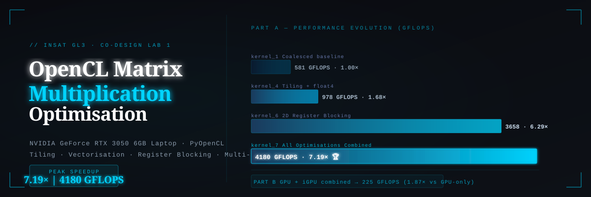

# OpenCL Matrix Multiplication — Hardware Optimisation



> **INSAT GL3 · CO-DESIGN LAB 1 · 2025–2026**  
> Progressive GPU kernel optimisation using PyOpenCL on an NVIDIA GeForce RTX 3050 6GB Laptop.

---

## Lab Report

The full lab report (figures, performance charts, kernel diagrams, and analysis) is available here:

> 📄 [**rapport_codesign.pdf**](docs/rapport_codesign.pdf)

---

## References & Inspiration

The kernel designs and optimisation progression in this project are directly inspired by the excellent tutorial series by **Cedric Nugteren**:

> 📖 [**How to optimize a GEMM** — cnugteren.github.io](https://cnugteren.github.io/tutorial/pages/page1.html)

This tutorial walks through GPU matrix multiplication optimisation step by step, from naive implementations to highly tuned kernels using local memory tiling, vectorisation, and register blocking. Our kernel sequence mirrors that progression, adapted and benchmarked on our specific hardware.

---

## Overview

This project explores hardware-level optimisation techniques applied to dense matrix multiplication using **OpenCL**. Starting from a simple coalesced kernel, we progressively apply memory hierarchy strategies — local tiling, vectorised loads, and 2D register blocking — and measure their impact. A second part distributes the workload across two heterogeneous OpenCL devices simultaneously.

**Peak result: 4180 GFLOPS — a 7.19× speedup over baseline.**

---

## Hardware Environment

| Parameter | Value |
|---|---|
| GPU | NVIDIA GeForce RTX 3050 6GB Laptop |
| Global memory | 6 GB |
| Local memory | 48 KB |
| Compute units (SMs) | 20 |
| Max work-group size | 1024 |
| Warp size | 32 |
| Global cache line | 128 Bytes |

---

## Part A — Kernel Optimisation

Each kernel builds on the previous, targeting a different bottleneck in the GPU memory hierarchy.

### `kernel_1.cl` — Coalesced Baseline

Each thread computes one output element of matrix C. Using `get_global_id(0)` as the inner loop iterator ensures **memory coalescence** — threads in a warp access contiguous memory locations — but every element is fetched from slow global memory on every access.

```
Time: ~37.8 s   |   Throughput: 581 GFLOPS   |   Speedup: 1.00×
```

---

### `kernel_4.cl` — Workgroup Tiling + Wider Data Types (`float4`)

Two complementary optimisations:

- **Workgroup Tiling**: Tiles of A and B are loaded cooperatively into `__local` (shared) memory. Each global memory fetch is reused by all threads in the workgroup, drastically reducing cache misses and global memory latency.
- **Wider Data Types**: Loads use `float4` (4 floats packed into one vector type), widening memory transactions and saturating the memory bus more efficiently.

```
Time: ~22.5 s   |   Throughput: 978 GFLOPS   |   Speedup: 1.68×
```

---

### `kernel_6.cl` — 2D Register Blocking

Relying solely on `__local` memory still incurs latency. This kernel makes each thread compute an **8×8 block** of output values (`WPTM=8`, `WPTN=8`) rather than a single element. A sub-tile of the working set is cached in **private GPU registers** (faster than local memory), dramatically reducing memory instruction count and increasing arithmetic intensity.

```
Time: ~6.0 s   |   Throughput: 3658 GFLOPS   |   Speedup: 6.29×
```

---

### `kernel_7.cl` — All Optimisations Combined

Combines all three strategies: **workgroup tiling** into local memory + **`float4` vectorised loads** + **2D register blocking**. Vectorised loads reduce the number of transactions to local memory while registers keep the compute pipelines busy without waiting on cache responses. The synergistic effect maximises instruction-level parallelism and pipeline efficiency.

```
Time: ~5.3 s   |   Throughput: 4180 GFLOPS   |   Speedup: 7.19× 🏆
```

---

### Part A Summary

| Kernel | Strategy | Time (s) | GFLOPS | Speedup |
|---|---|---|---|---|
| `kernel_1` | Coalesced baseline | ≈ 37.8 | 581 | 1.00× |
| `kernel_4` | Local tiling + `float4` | ≈ 22.5 | 978 | 1.68× |
| `kernel_6` | 2D register blocking | ≈ 6.0 | 3658 | 6.29× |
| `kernel_7` | All optimisations | ≈ 5.3 | 4180 | **7.19×** |

---

## Part B — Multi-Device Execution

The matrix multiplication is split between two OpenCL devices running concurrently:

- **NVIDIA RTX 3050** (dedicated GPU): runs the non-coalesced simple kernel
- **Intel integrated GPU (iGPU)**: runs the fully optimised `kernel_7`

### Independent Benchmarks (N = 8192)

| Device | Kernel | Throughput |
|---|---|---|
| NVIDIA GPU (dedicated) | Non-coalesced | ≈ 120.29 GFLOPS |
| Intel iGPU (integrated) | Optimised (`kernel_7`) | ≈ 128.60 GFLOPS |

> **Note**: The dedicated GPU running a non-coalesced kernel on massive matrices (N=8192) collapses in throughput, making it slower than the weaker integrated GPU running an optimised kernel — a striking demonstration of how much kernel quality matters.

### Load Distribution Strategy

To ensure both devices finish simultaneously, rows of matrix M are distributed proportionally to each device's measured throughput:

$$\text{Split}_{\text{iGPU}} = \frac{P_{\text{iGPU}}}{P_{\text{iGPU}} + P_{\text{GPU}}} \approx 51.6\%$$

$$\text{Split}_{\text{GPU}} = \frac{P_{\text{GPU}}}{P_{\text{iGPU}} + P_{\text{GPU}}} \approx 48.4\%$$

### Combined Result

```
Time: ~4.88 s   |   Throughput: 225.34 GFLOPS   |   Speedup vs GPU-only: 1.87×
```

The concurrent command queues also enable **overlapping of host-to-device transfers** with kernel execution, further hiding memory latency.

---

## Project Structure

```
.
├── A/
│   ├── host_code.py        # Part A host: kernel selection, OpenCL setup, benchmarking
│   ├── kernel_1.cl         # Coalesced baseline kernel
│   ├── kernel_4.cl         # Workgroup tiling + float4 vectorisation
│   ├── kernel_6.cl         # 2D register blocking
│   └── kernel_7.cl         # Fully combined optimised kernel
├── B/
│   ├── host_code.py        # Part B host: multi-device split execution
│   ├── gpu_kernel.cl       # Simple kernel for the dedicated GPU
│   └── cpu_kernel.cl       # Optimised kernel for the integrated GPU
├── banner.svg              # Repository banner
└── rapport_codesign.pdf    # Full lab report
```

---

## Requirements

```bash
pip install numpy pyopencl
```

An OpenCL-compatible GPU and appropriate drivers are required. For NVIDIA: install CUDA toolkit. For Intel iGPU: install Intel OpenCL Runtime.

---

## Running

### Part A

```bash
cd A
python host_code.py
```

You will be prompted to:
1. Choose matrix dimensions (default: 8192×8192)
2. Select a kernel (0–3)
3. Configure tile sizes and blocking parameters

### Part B

```bash
cd B
python host_code.py
```

You will be prompted to enable/disable GPU and iGPU and configure their respective kernel parameters.

---

## Key Takeaways

- **Coalescence alone is insufficient**: simply avoiding bank conflicts leaves most of the GPU's potential unused.
- **The memory hierarchy is everything**: local memory tiling → register blocking → each level brings a multiplicative gain.
- **Vectorisation widens the memory bus**: `float4` loads increase effective bandwidth utilisation significantly.
- **Heterogeneous co-execution requires calibration**: a workload split proportional to each device's actual throughput is essential — an equal split would leave one device idle while the other becomes the bottleneck.
- **An optimised kernel on a weaker device beats a naive kernel on a stronger one**: the iGPU running `kernel_7` outperformed the dedicated RTX 3050 running a non-coalesced kernel.

---

## Authors

| Name | |
|---|---|
| Bahri Amal | |
| Khili Karim | |
| Chaouch Tasnim | |
| Ourabi Dorra | |

*Institut National des Sciences Appliquées et de Technologie (INSAT) — April 2026*
